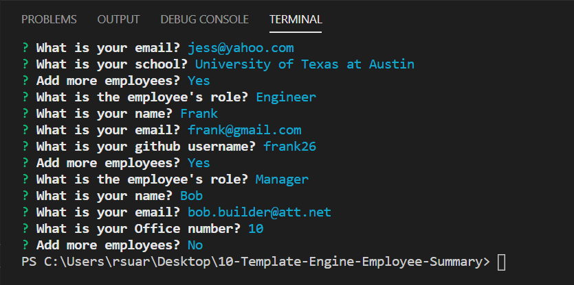
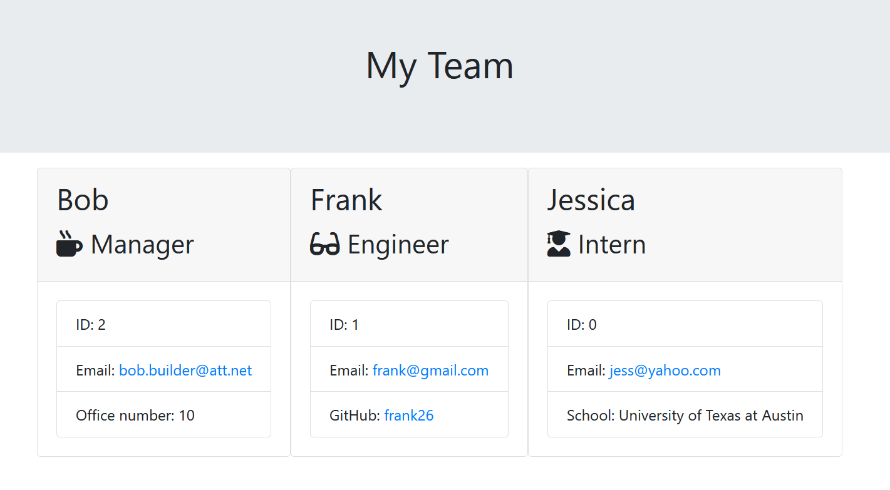

# 10-Template-Engine-Employee-Summary

## Description
This command line application generates an html file containing employee information. The user can run the app.js file in node. They will then be prompted with questions to input an employee's information. The answers will be used to generate an html file containing all of the employees. Each employee can be assigned a role such as: Manager, Engineer, or Intern.

## Challenges 
Making sure the classes all pass the tests and build up from the employee class.
When the user is being propmted, making sure the app waits for all the information to be created before creating the html file. Making sure the employees are made into the correct class.

## Installation Instructions
Make sure you have all of files from the directory. Then make sure you have node installed. Use "npm install" to install the required dependencies. You can use the command "node app.js" to run the application

## Usage Instructions

This application is run using node. Here is a picture of the terminal in VSCode

This is an example of the page generated.

This video shows how the application runs on VSCode https://drive.google.com/file/d/1nQvx_y7EPvw53mVSqiCXrDJSnivW3fMl/view

## Tests
The tests are used to make sure each employee class meets certain criteria.